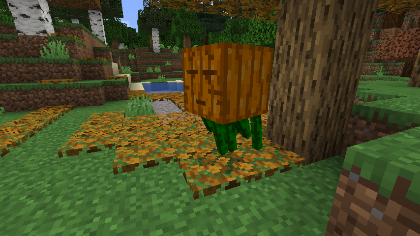

# FallFest 1.16 - Ghost

Mod made for [Fallfest 1.16](https://modfest.net/fallfest/1.16/).

## Ghost entity
Adds a Fallfest "Ghost" entity to world spawn as well as crafting recipe with 2 cobwebs and a carved pumpkin.

## Interaction with the world
The Ghost spreads Fallen Leaves while walking around (similar to snow golem).
The Ghost turns leaves around it into their fall variant.

## Interaction with the player
The Ghost will follow the player around at night in an effort to "Trick or Treat" with them.
If the player treats the ghost (gives them something edible) they will receive a treat (positive status effect) or a trick (negative status effect) in return, depending on the food given.
